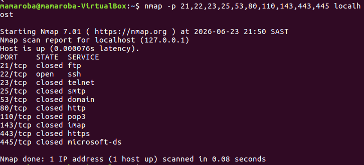

1. Command Used

- nmap -p 21,22,23,25,53,80,110,143,443,445 localhost

2. findings

A scan of common ports on localhost revealed that Port 22 (SSH) was open.

All other scanned ports were closed, including:

- Port 21 (FTP)
- Port 23 (Telnet)
- Port 25 (SMTP)
- Port 53 (DNS)
- Port 80 (HTTP)
- Port 110 (POP3)
- Port 143 (IMAP)
- Port 443 (HTTPS)
- Port 445 (SMB)

This indicates that SSH was the only active service detected among the selected common ports.

3.  Analysis

The scan showed that only Port 22 was open.

This suggests that the system is running an SSH service while the other common services are not installed or not currently listening for connections.

Having fewer open ports generally reduces the number of services that could potentially be targeted by an attacker.

4. Lesson Learned

- Different services use different well-known ports.
- Nmap can identify whether a port is open or closed.
- Closed ports indicate that no service is listening on that port.
- SSH commonly uses Port 22.
- Systems with fewer open ports generally have a smaller attack surface.
  
5. 
  
