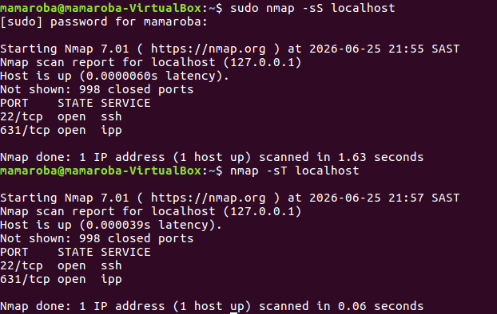

Commands Used

-sudo nmap -sS localhost

-nmap -sT localhost

Findings

-Both the SYN scan and TCP Connect scan identified Port 22 and 631 as open.

-The scans produced similar results regarding open ports.

Analysis

-The SYN scan (-sS) performs a partial TCP handshake to determine whether a port is open.

-The TCP Connect scan (-sT) performs a full TCP connection.

-Both scan types successfully identified open ports on the target system.

 Lesson learned

- Nmap supports multiple scan types.
- SYN scans are often called half-open scans.
- TCP Connect scans complete the full TCP handshake.
- Different methods can be used to identify open ports.
- Different scan types may be used depending on permissions and the environment.

