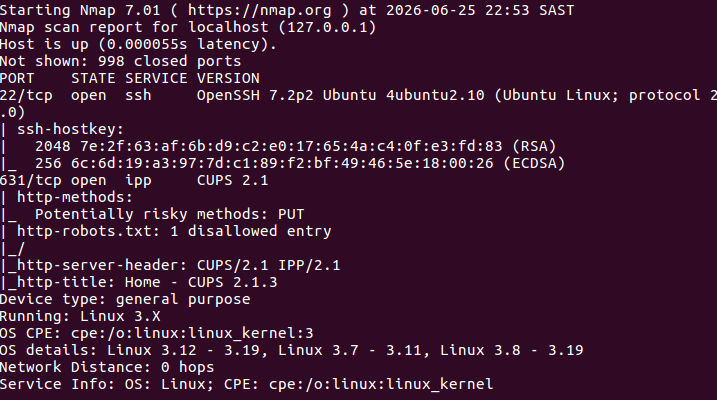

Objective

-To use Nmap's Aggressive Scan (-A) to gather detailed information about the target system, including open ports,
service versions, operating system details, and information collected by the Nmap Scripting Engine (NSE).

Command Used

-sudo nmap -A localhost

Findings

The Aggressive Scan successfully identified two open ports on the target system: Port 22 (SSH) running OpenSSH 7.2p2 Ubuntu 4ubuntu2.10 and Port 631 (IPP) running CUPS 2.1. 
Nmap also detected the target operating system as Linux, identified the device as a general-purpose computer, 
retrieved the SSH host keys, and gathered additional information from the CUPS web interface using the 
Nmap Scripting Engine (NSE), including supported HTTP methods, server header information, and the web page title.
The scan confirmed that the host was online with a network distance of 0 hops.

Analysis

The -A option enabled several advanced Nmap features in a single scan.

Unlike a basic scan, which only identifies open ports, the Aggressive Scan collected additional information about the target system.

The scan successfully identified:

Open ports

Running services

Software versions

SSH host keys

HTTP information

Operating system details

Device type

The target exposed only two services (SSH and CUPS), resulting in a relatively small attack surface.

The SSH service is commonly used for secure remote administration, while the CUPS service provides printing functionality over the network.

The NSE scripts revealed that the CUPS web interface supported the HTTP PUT method and disclosed version information. Although this does not necessarily indicate a vulnerability, these findings should be reviewed to ensure the services are configured securely.

Because the scan targeted localhost, the network distance was zero hops and the latency was extremely low.

Lessons Learned

-The -A option performs an Aggressive Scan that combines multiple scanning techniques.

-Nmap can identify software versions running on open ports.

-Nmap can estimate the target operating system using fingerprinting techniques.

-The Nmap Scripting Engine (NSE) automatically gathers additional information about detected services.

-Open ports do not automatically indicate vulnerabilities, but they should always be reviewed to determine whether the services are necessary and securely configured.

-Systems with fewer exposed services generally have a smaller attack surface.

