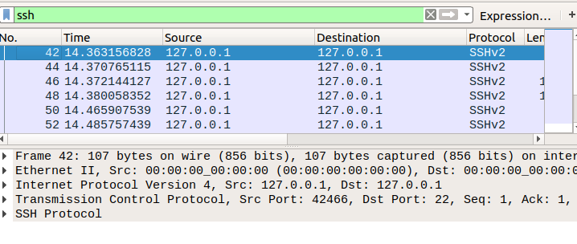
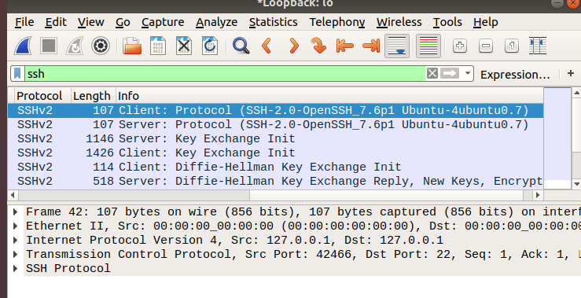
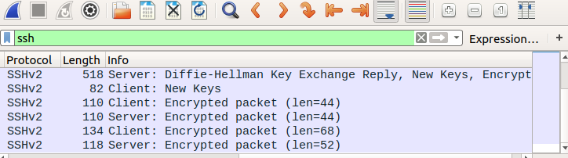

Objective

-The objective of this lab is to capture and analyze SSH traffic using Wireshark and 
understand how Secure Shell establishes an encrypted remote connection while protecting transmitted data.

Command Used

-ssh localhost

Findings
-Wireshark captured the SSH connection establishment between the client and the local SSH server.
The capture included the SSH protocol version exchange, key exchange initialization, 
Diffie-Hellman key exchange, and the transition to encrypted communication. 
After the key exchange completed, SSH switched to encrypted packets, protecting the confidentiality of the session.

Analysis

-The packet capture demonstrated how SSH establishes a secure remote connection. 
Both the client and server first exchanged their supported SSH protocol versions, confirming compatibility. 
They then negotiated cryptographic algorithms through the key exchange initialization process.
The Diffie-Hellman key exchange enabled both systems to generate a shared secret without transmitting it directly.
Once the key exchange was complete, the session transitioned to encrypted communication, ensuring that commands, 
authentication data, and terminal output could not be viewed in plain text.

Lessons Learned

-SSH begins by exchanging protocol version information.

-The client and server negotiate compatible cryptographic algorithms.

-Diffie-Hellman enables a secure shared key to be established without transmitting the key itself.

-After key exchange, SSH encrypts all communication.

-Wireshark can identify the SSH handshake but cannot reveal the contents of the encrypted session.

Screenshots

-ssh filter

-Version and key exchange

-Encrypted traffic

