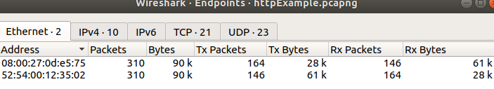

Objective

-The objective of this lab is to use Wireshark's built-in statistics tools to identify the most active hosts,
 protocols, and conversations within a packet capture.This lab focuses on Wireshark's graphical analysis tools.

 Findings

 -Wireshark's Statistics tools identified the protocols, endpoints, and conversations present in the packet capture.
  The Protocol Hierarchy view summarized protocol usage, while the Conversations window displayed communication between hosts.
  The Endpoints view identified the devices responsible for sending and receiving the largest amount of network traffic.

  Analysis

  -The Protocol Hierarchy provided a high-level summary of the captured network traffic. 
   The results confirmed that the communication followed the standard protocol stack of Ethernet, IPv4, TCP, HTTP,DNS,UDP.
   The Conversations statistics provided a summary of communication between network endpoints.
   The Endpoints statistics summarized network activity for each participating device. 
   The analysis showed balanced two-way communication between the virtual machine and the gateway

   Screenshots

   -Protocol Hierachy

   

   -Conversatons

   

   -Endpoints

   
 

 
