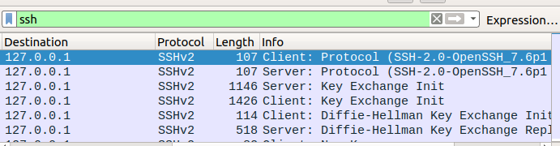
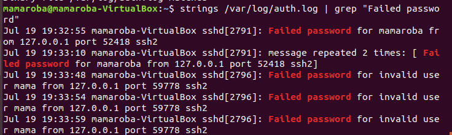

Objective

-The objective of this lab is to simulate failed SSH login attempts and analyze both the network traffic in Wireshark
 and the authentication logs in Ubuntu to identify indicators of a brute-force attack.

 Commands Used

 - Generate failed logins: ssh wronguser@localhost

 - Checking failed logins: strings /var/log/auth.log | grep "Failed password"

Findings

-The Ubuntu authentication logs recorded multiple failed SSH login attempts originating from the localhost address (127.0.0.1).
 The logs included failed authentication attempts against both a valid user account and invalid usernames.
 Ubuntu also summarized repeated failures using the message "message repeated 2 times," 
 indicating multiple identical failed login attempts within a short period.
 Wireshark captured the encrypted SSH session establishment but did not reveal authentication credentials because SSH encrypts its payload.

 Analysis
 
- The investigation demonstrated the importance of combining network captures with host-based logs
  The authentication logs demonstrated how Ubuntu records SSH login failures.
  Attempts using a valid username resulted in "Failed password for <username>" entries,
  while attempts using non-existent accounts produced "Failed password for invalid user" messages. 
  Repeated failures from the same source IP address are characteristic of brute-force attacks and can be used by SOC analysts
  to identify unauthorized access attempts. Although the activity in this lab was generated locally for testing purposes, 
  the logging behavior mirrors what would be observed during a real attack.

  Lesson Learned

  -Network traffic and system logs complement each other during incident investigations.

  -Ubuntu records failed SSH login attempts in its authentication logs.

  -Source IP addresses and source ports help identify where login attempts originated.

  -Repeated authentication failures can indicate a brute-force attack.

  Screenshots

  -ssh packets capture

  

  -Failed login Attempts

  

 
