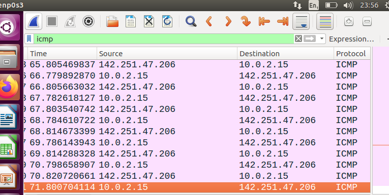
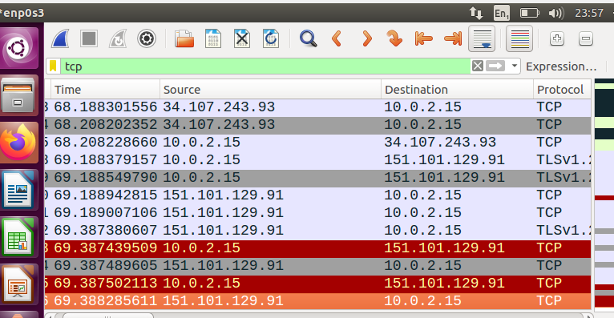
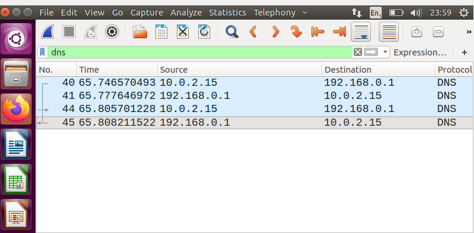
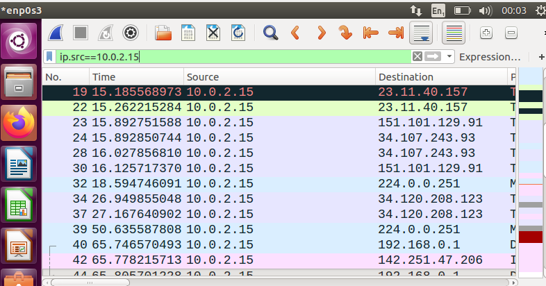
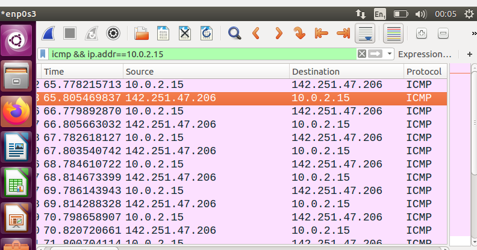

Objective

-The objective of this lab is to learn how to use Wireshark display filters to isolate and analyze specific network traffic.
Display filters help analysts quickly locate relevant packets without modifying the original packet capture.

Actions Performed

-Opened a packet capture in Wireshark.

-Applied different display filters.

-Observed the packets displayed after each filter.

Findings

-Wireshark display filters successfully isolated specific types of network traffic from the packet capture.
The original packet capture remained unchanged, demonstrating that display filters only affect how packets are viewed.

Analysis

-Display filters allow analysts to focus on relevant traffic without manually searching through every captured packet. 
This significantly improves the efficiency of network investigations, especially when analyzing large packet captures.
These filtering techniques are essential during incident response and network troubleshooting because they enable 
analysts to quickly locate traffic related to a particular protocol, host, or communication.

Lessons Learned

-Display filters only change what is displayed; they do not modify the packet capture.

-Protocol filters can isolate specific types of network traffic.

-Combined filters provide more targeted search results.

-Display filters improve the speed and accuracy of network traffic analysis.

Screenshots

-filter by icmp

-filter by tcp

-filter by dns

-filter by ip src

-Combined filter 

-
