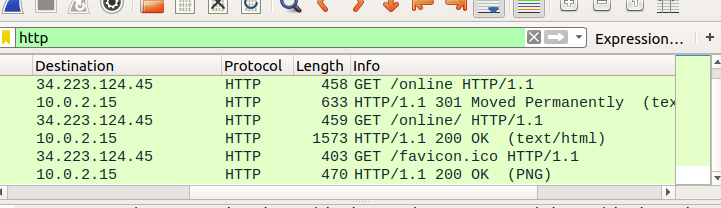
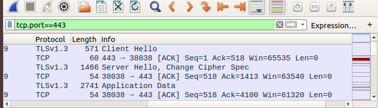

Objective

-The objective of this lab is to compare HTTP and HTTPS traffic using Wireshark
 and understand how encryption protects sensitive information transmitted over a network.

 Actions Used

 -http://neverssl.com 
 
 - http filtered with http

 -https://www.google.com

 -https filtered with tcp.port==443

 Analysis

-The comparison demonstrated the importance of HTTPS in protecting data transmitted over a network. 
 HTTP sends information in plain text, allowing anyone with access to the traffic to read its contents.
 HTTPS establishes a secure connection using TLS, encrypting the communication before application data is exchanged.

 Lessons Learned

-HTTP transmits data in plain text.

-HTTPS transmit encrypted data

-Wireshark can display HTTP requests and responses when traffic is unencrypted.

-Wireshark cannot display the contents of encrypted HTTPS application data.

 -HTTPS provides confidentiality and integrity for web communications.

Screenshots

-HTTP traffic filtered with http

-HTTPS traffic filtered with tcp.port==443

 
