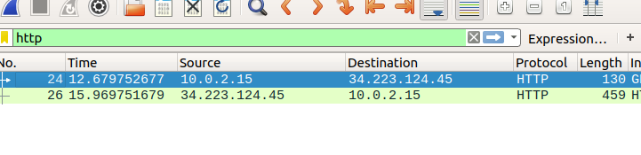
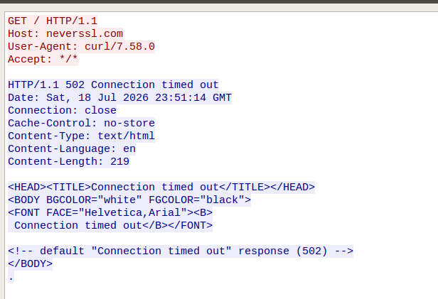

Objective

-The objective of this lab is to use Wireshark's Follow TCP Stream feature to reconstruct and analyze a 
 complete TCP conversation between a client and a server.This  feature combines packets into one readable coversation.

Command Used

-curl http://neverssl.com

Findings

-Wireshark successfully reconstructed the complete TCP conversation between the client and neverssl.com using the Follow TCP
 Stream feature. The stream displayed the HTTP GET request generated by curl and the corresponding HTTP response from the server.
 The server returned a 502 Connection timed out error together with HTTP headers and an HTML error page, demonstrating that 
 Wireshark can reconstruct both requests and responses exchanged during an unencrypted HTTP session.

 Analysis

-The reconstructed TCP stream showed the full application-layer communication rather than individual packets. 
 The client requested the root resource (/) from neverssl.com, and the server responded with an HTTP 502 error indicating 
 that a timeout occurred while processing the request. The response included headers such as Connection: close,
 which instructed the client to terminate the TCP connection after receiving the response.
 This demonstrates the value of the Follow TCP Stream feature for troubleshooting web application problems and understanding
 complete client-server interactions. 

 Lessons Learned

 -Wireshark can reconstruct an entire TCP conversation.

 -The Follow TCP Stream feature combines many packets into one readable conversation.

 Screenshots

-http filter applied

-follow stream tcp

