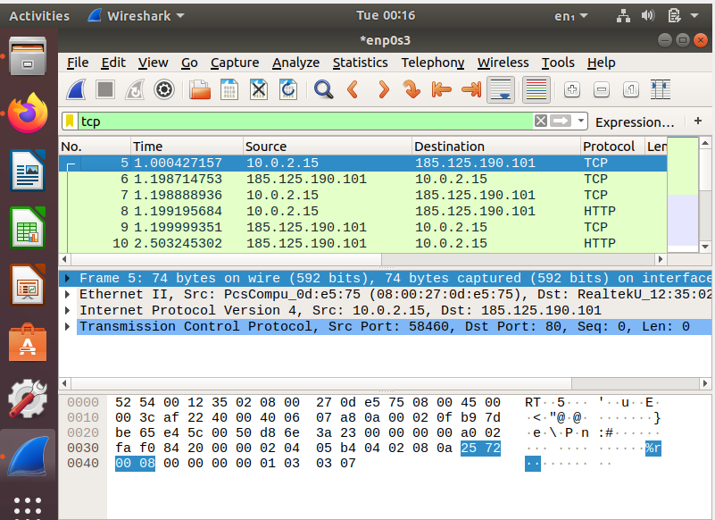
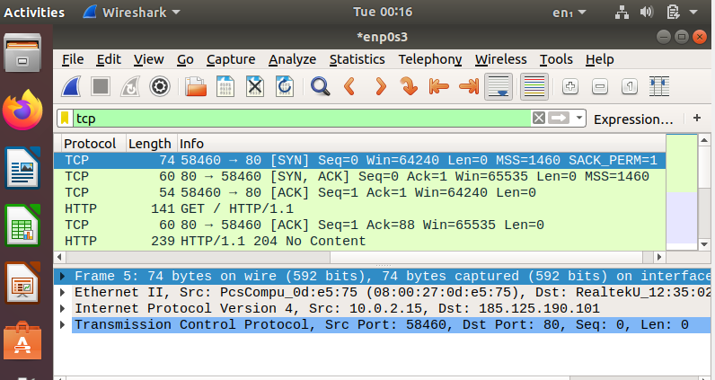

Objective

-The objective of this lab is to capture and analyze the TCP three-way handshake using Wireshark and understand 
how two devices establish a reliable TCP connection before exchanging data.

Command used

-ssh localhost

Findings

-Wireshark captured the TCP three-way handshake during the establishment of a TCP connection. 
 The packet capture showed the client sending a SYN packet, the server responding with a SYN-ACK packet, 
 and the client completing the handshake with an ACK packet. 
 This sequence confirmed that a reliable TCP connection was successfully established before any application data was exchanged.

 Analysis

-The packet capture demonstrated how TCP establishes reliable communication between two devices. 
 The three-way handshake ensures that both the client and the server are ready to exchange data before the session begins.
 By applying the tcp display filter, the handshake packets were isolated from other network traffic, 
 making it easier to identify the connection establishment process.
 Understanding the handshake is important for troubleshooting failed connections, 
 recognizing abnormal network behavior, and identifying attacks such as SYN flood attacks.

 Lessons Learned

 -TCP is a connection-oriented protocol.
 
 -Every TCP connection begins with a three-way handshake.
 
 -The handshake consists of SYN, SYN-ACK, and ACK packets.
 
 -Wireshark can capture and display the connection establishment process.

 Screenshots

 -tcp display filter

 

 - three-way handshake shown

    
