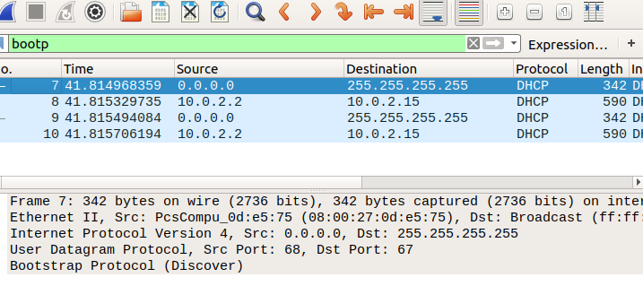
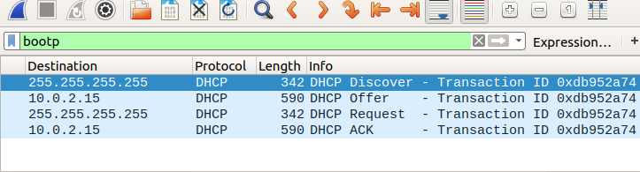

Objective

-The objective of this lab is to capture and analyze DHCP traffic using Wireshark and understand
 how a client automatically obtains an IP address and other network configuration information from a DHCP server.

 Commands Used

-sudo dhclient -r enp0s3

-sudo dhclient  enp0s3

Findings

-Wireshark captured the DHCP lease process between the client and the DHCP server.
 The packet capture showed the four-step DORA sequence consisting of Discover, Offer,
 Request, and Acknowledgement (ACK) messages.

 Analysis
 
-The captured DHCP traffic demonstrated how devices automatically obtain network configuration when joining a network.
 The client first broadcast a Discover message to locate available DHCP servers. 
 The server responded with an Offer containing an available IP address. 
 The client then requested the offered address, and the server finalized the process by sending an ACK message      confirming the lease.
 This automatic configuration process simplifies network management and ensures that devices can communicate without manual IP configuration.

Lessons Learned

-DHCP automatically assigns IP addresses to network devices.

-The DHCP process follows the Discover, Offer, Request, and ACK (DORA) sequence.

-Wireshark can capture and analyze the DHCP lease process.

Screenshots

-bootp filter applied

-DORA Sequence

